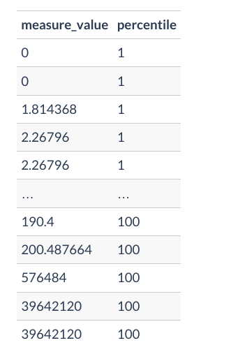
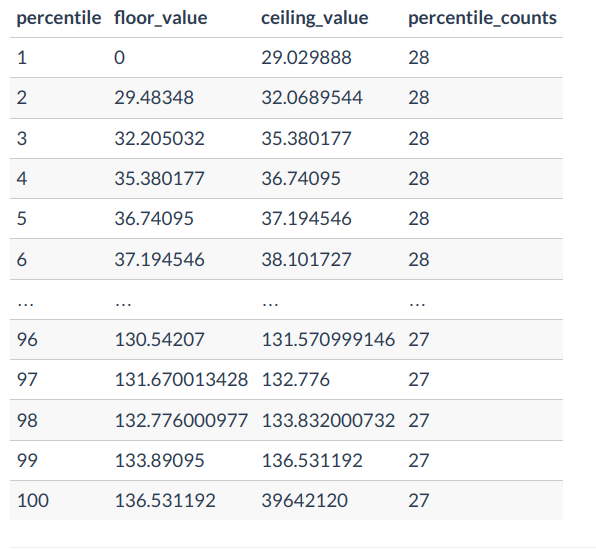
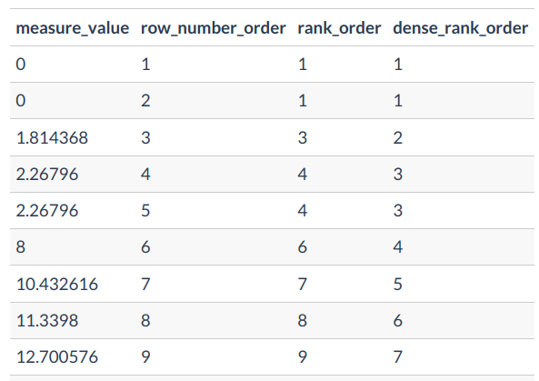
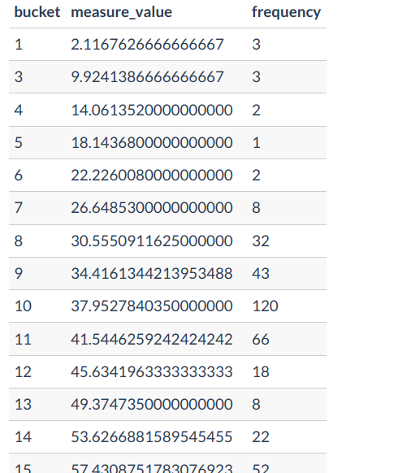

#### 1. percentile values for continious RV
creates buckets
~~~~sql
SELECT
  measure_value,
  NTILE(100) OVER (
    ORDER BY
      measure_value
  ) AS percentile
FROM health.user_logs
WHERE measure = 'weight'
~~~~

#### 2. using above buckets to create floor and ciel and counts
~~~~sql
WITH percentile_values AS (
  SELECT
    measure_value,
    NTILE(100) OVER (
      ORDER BY
        measure_value
    ) AS percentile
  FROM health.user_logs
  WHERE measure = 'weight'
)
SELECT
  percentile,
  MIN(measure_value) AS floor_value,
  MAX(measure_value) AS ceiling_value,
  COUNT(*) AS percentile_counts
FROM percentile_values
GROUP BY percentile
ORDER BY percentile;
~~~~

#### 3.Intro to rank,dense rank,row_num
~~~~sql
WITH percentile_values AS (
  SELECT
    measure_value,
    NTILE(100) OVER (
      ORDER BY
        measure_value
    ) AS percentile
  FROM health.user_logs
  WHERE measure = 'weight'
)
SELECT
  measure_value,
  ROW_NUMBER() OVER (ORDER BY measure_value) as row_number_order,
  RANK() OVER (ORDER BY measure_value) as rank_order,
  DENSE_RANK() OVER (ORDER BY measure_value) as dense_rank_order
FROM percentile_values
WHERE percentile = 1
ORDER BY measure_value;
~~~~

#### 4. histograms
~~~~sql
SELECT
  WIDTH_BUCKET(measure_value, 0, 200, 50) AS bucket,
  AVG(measure_value) AS measure_value,
  COUNT(*) AS frequency
FROM clean_weight_logs
GROUP BY bucket
ORDER BY bucket;
~~~~

