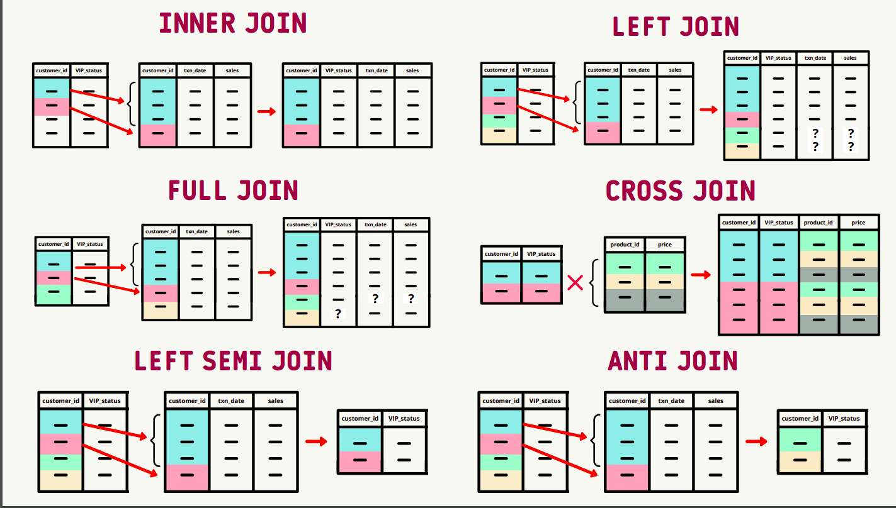
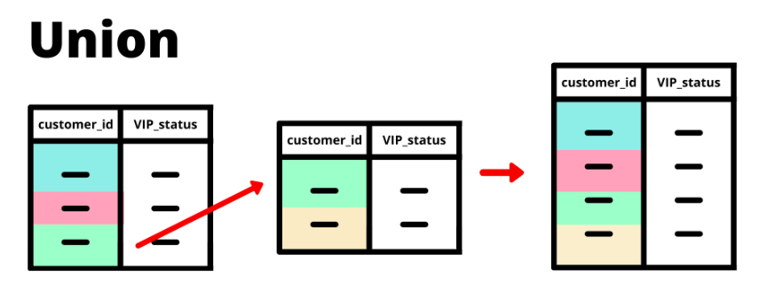
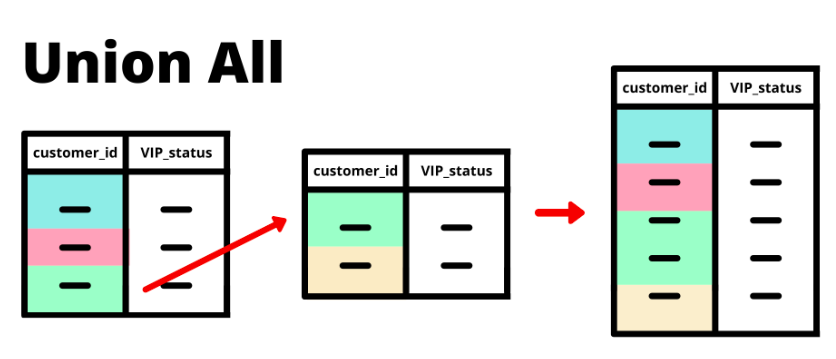

#### 1. Inner ,left,full outer: single key
~~~~sql
SELECT
  names.iid,
  names.first_name,
  names.title,
  jobs.occupation,
  jobs.salary
FROM names
INNER JOIN jobs
  ON names.iid = jobs.iid;
~~~~
replace inner join key word with left and outer join

#### 2. cross join is a cross product
can be computationally expensive: thread carefully
~~~~sql
SELECT
  names.iid as name_iid,
  jobs.iid as job_iid,
  names.first_name,
  names.title,
  jobs.occupation,
  jobs.salary
FROM names
CROSS JOIN jobs;
~~~~

3. #### Left semi join
A left semi join is actually really similar to an INNER JOIN where it captures only the matching records between left and right tables BUT it differs in one very key way: 
it only returns records from the left table - no columns or rows from the right table are included in the output.

Postgres SQL syntax
~~~~sql
SELECT
  names.iid,
  names.first_name
FROM names
WHERE EXISTS (
  SELECT iid -- this can be variable(can also be a number) since we are interested only in table 1 contentes  
  FROM new_jobs
  WHERE names.iid = new_jobs.iid
);
~~~~

Other Syntax
~~~~sql
SELECT
  names.iid,
  names.first_name
FROM names
LEFT SEMI JOIN new_jobs
ON names.iid = new_jobs.iid;
~~~~

#### 4 Anti join
Opposite of semi join (i.e) Set(Table1) - set(table2)

Postgres Syntax
~~~~sql
SELECT
  names.iid,
  names.first_name
FROM names
WHERE NOT EXISTS (
  SELECT 1
  FROM new_jobs
  WHERE names.iid = new_jobs.iid
);
~~~~

Other Syntax
~~~~sql
SELECT
  names.iid,
  names.first_name
FROM names
ANTI JOIN new_jobs
  ON names.iid = new_jobs.iid
~~~~

#### 4 Union

~~~~sql
SELECT * FROM names where first_name = 'Danny'
UNION
SELECT * FROM names where first_name = 'Kate';
~~~~

#### Union all
~~~~sql
SELECT * FROM names where first_name = 'Danny'
UNION ALL
SELECT * FROM names where first_name = 'Kate';
~~~~

read about this also: except and intersect

