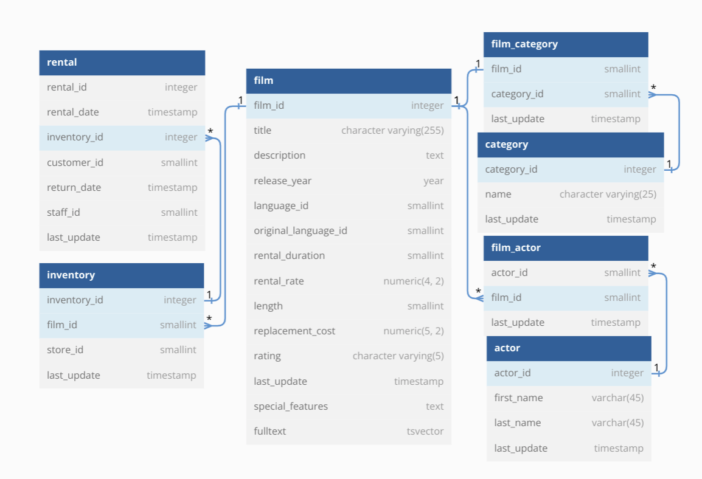
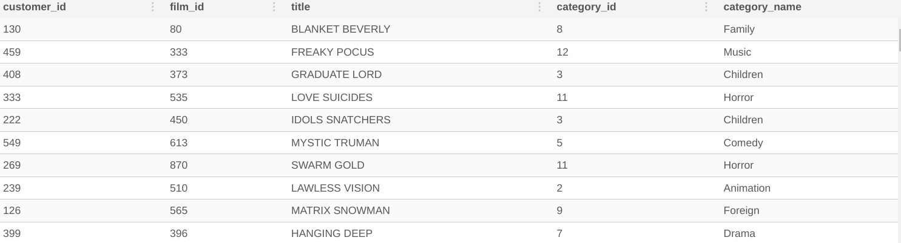

### Problem Statement

### ER diagram

#### 0.0 good way to view distribution of discrete RV
~~~~sql
-- first generate group by counts on the target_column_values column
WITH counts_base AS (
SELECT
  inventory_id AS target_column_values,
  COUNT(*) AS row_counts
FROM dvd_rentals.rental
GROUP BY target_column_values
)
-- summarize the group by counts above by grouping again on the row_counts from counts_base CTE part
SELECT
  row_counts,
  COUNT(target_column_values) as count_of_target_values
FROM counts_base
GROUP BY row_counts
ORDER BY row_counts;
~~~~

#### 1 join table to get this
~~~~sql
DROP TABLE IF EXISTS complete_joint_dataset;
CREATE TEMP TABLE complete_joint_dataset AS
SELECT
  rental.customer_id,
  inventory.film_id,
  film.title,
  film_category.category_id,
  category.name AS category_name
FROM
  dvd_rentals.rental
  INNER JOIN dvd_rentals.inventory ON rental.inventory_id = inventory.inventory_id
  INNER JOIN dvd_rentals.film ON inventory.film_id = film.film_id
  INNER JOIN dvd_rentals.film_category ON film.film_id = film_category.film_id
  INNER JOIN dvd_rentals.category ON film_category.category_id = category.category_id;

~~~~

